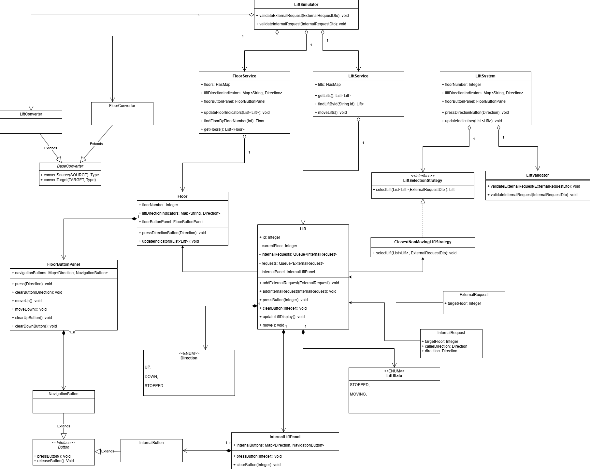
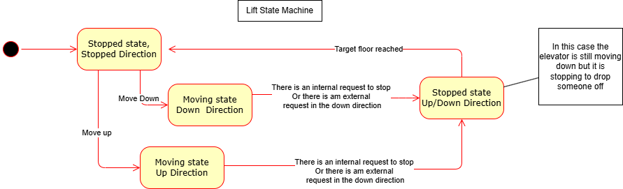

# Lift System Description

This project is a simulation of a lift system. The system is composed of a building with a number of floors and a number of lifts. The lifts move between the floors to pick up and drop off passengers. The system is controlled by a central controller that decides which lift should pick up a passenger based on the current location of the lifts and the destination floor of the passenger.

s
    

The project is about simulating a lift system. It is made of a bulding with seven floors and two lifts. The application is Managed by a Lift Scheduler which at every two seconds performs a system update depending on the available request. The application itself is a state machine which transitions between multiple states.

The Frontend application is written in React which provides a minimalisitc UI for representing the lifts and the control panels for the floors and the lifts.

The Backend application is written in Java Spring Boot.

    

The frontend and the backend are connected via websockets. The backend broadcasts the messgages to the Frontend whenever there is a change in the state of the system.

These are the current state transitions of the system:

    

